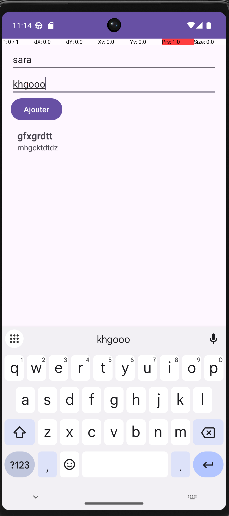

# LAB 19 : Room, MVVM, Repository, ViewModel, LiveData et RecyclerView

## Objectif

L'objectif de ce laboratoire est de développer une application Android moderne permettant la gestion de notes en utilisant l'architecture MVVM et la bibliothèque Room pour la persistance locale des données.

L'application permet :

- Ajouter une note
- Afficher les notes enregistrées
- Supprimer une note par clic long
- Conserver les données après fermeture de l'application
- Observer automatiquement les changements grâce à LiveData

---

## Architecture utilisée

Le projet suit l'architecture MVVM (Model - View - ViewModel).

```text
MainActivity
      │
      ▼
NoteViewModel
      │
      ▼
NoteRepository
      │
      ▼
NoteDao
      │
      ▼
Room Database
```

Cette architecture permet une meilleure séparation des responsabilités et facilite la maintenance du projet.

---

## Structure du projet

```text
projet.fst.ma.lab19

├── data
│   ├── Note.java
│   ├── NoteDao.java
│   └── NoteDatabase.java
│
├── repository
│   └── NoteRepository.java
│
├── viewmodel
│   └── NoteViewModel.java
│
├── adapter
│   └── NoteAdapter.java
│
└── MainActivity.java
```

---

## Description des composants

### Note.java

Représente l'entité persistée dans la base de données.

Attributs :

- id
- titre
- description

Room crée automatiquement la table correspondante.

---

### NoteDao.java

Interface contenant les opérations d'accès aux données :

- insertion d'une note
- suppression d'une note
- récupération de toutes les notes

---

### NoteDatabase.java

Point d'accès central à la base de données Room.

Responsabilités :

- création de la base SQLite
- création de l'instance unique (Singleton)
- fourniture du DAO

---

### NoteRepository.java

Couche intermédiaire entre le ViewModel et Room.

Responsabilités :

- centraliser l'accès aux données
- exécuter les opérations en arrière-plan
- éviter les accès directs à Room depuis l'interface

---

### NoteViewModel.java

Couche de présentation.

Responsabilités :

- exposer les données à l'interface
- survivre aux changements de configuration
- communiquer avec le Repository

---

### NoteAdapter.java

Adaptateur RecyclerView.

Responsabilités :

- afficher les notes
- gérer les clics longs pour la suppression
- mettre à jour automatiquement la liste

---

### MainActivity.java

Interface utilisateur principale.

Fonctionnalités :

- saisie du titre
- saisie de la description
- ajout d'une note
- affichage des notes
- suppression d'une note par clic long

---

## Technologies utilisées

- Java
- Android Studio
- Room
- SQLite
- RecyclerView
- LiveData
- ViewModel
- MVVM

---

## Fonctionnement de l'application

1. L'utilisateur saisit un titre.
2. L'utilisateur saisit une description.
3. Le bouton Ajouter crée une nouvelle note.
4. La note est enregistrée dans Room.
5. LiveData détecte automatiquement le changement.
6. RecyclerView se met à jour sans recharger l'écran.
7. Un clic long sur une note permet sa suppression.
8. La suppression est immédiatement répercutée dans l'interface.

---

## Démonstration

### Interface de l'application

L'image suivante montre :

- le champ Titre
- le champ Description
- le bouton Ajouter
- la liste des notes enregistrées



---

## Résultat obtenu

L'application développée permet :

- l'ajout dynamique de notes
- l'affichage automatique via RecyclerView
- la persistance locale des données grâce à Room
- la suppression d'une note par clic long
- l'utilisation complète de l'architecture MVVM

---

## Conclusion

Ce laboratoire a permis de mettre en pratique plusieurs composants fondamentaux du développement Android moderne. L'utilisation conjointe de Room, Repository, ViewModel, LiveData et RecyclerView permet de construire une application structurée, maintenable et réactive. Les données sont stockées localement et l'interface se met à jour automatiquement lorsqu'une modification est effectuée dans la base.
